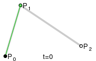
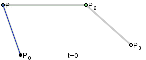
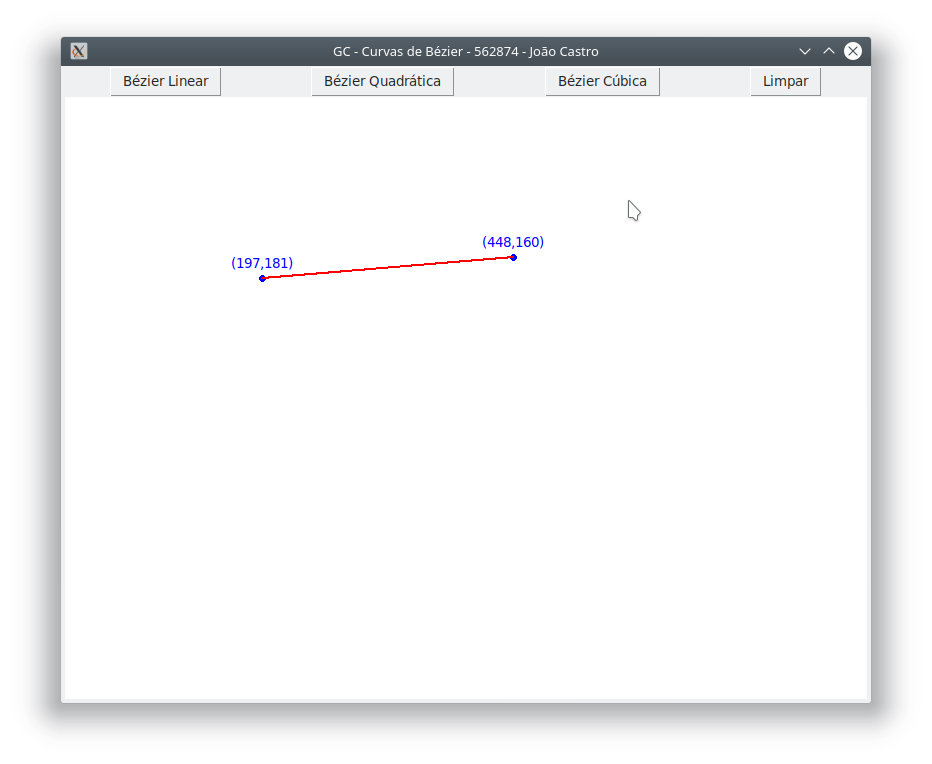
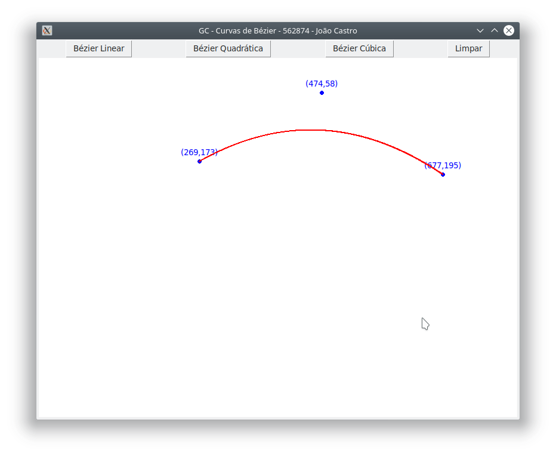
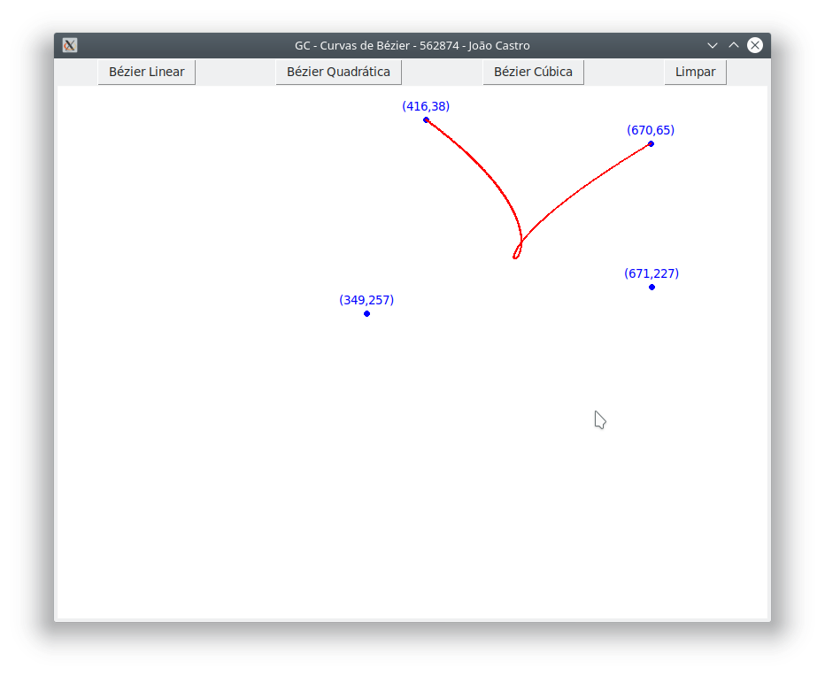
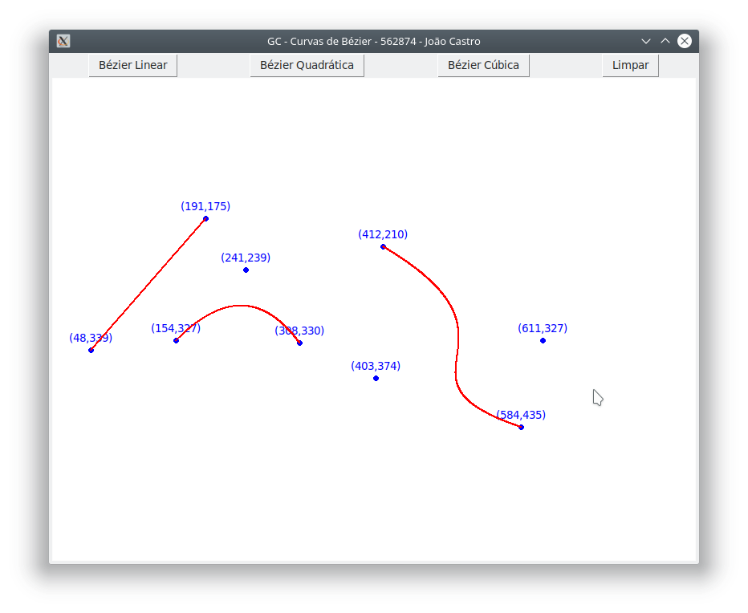

# Curvas Paramétricas

> Trabalho acadêmico para disciplina de Computação Gráfica pela PUC Minas.
> Implementação de uma curva paramétrica, neste caso, Curva de Bézier. 

### Curva de Bézier

A curva de Bézier é uma curva polinomial, expressa com a interpolação linear entre alguns pontos representativos(Pontos de controle). Por ser uma curva altamente aplicada em diversos programas(Gimp, Photoshop, Inkscape..) foi escolhida como exemplo para este trabalho.

Exemplos: 





### Instalação

Como a linguagem utilizada neste trabalho foi Python 3.6.6, para executar o ambiente gráfico é necessário que o python3 esteja instalado em sua máquina.

#### Linux

Em muitas distribuições linux o python 2 e 3 já vem instalados nativamente devido a dependencia de alguns programas. Abra o terminal e execute o seguinte comando `python3 --version`. Caso o resultado deste comando não seja a versão do python3 instalado, execute os comandos abaixo:

```shell
$ sudo apt-get update
$ sudo apt-get install python3
```

#### Windows 

Faça o download do [Python 3.6.6](https://www.python.org/downloads/windows/) (ou mais recente) e o instale.
Obs: Não se esqueça de adicionar o caminho da instalação a suas variáveis de ambiente:[Instalação Python Windows](https://python.org.br/instalacao-windows/)

### Bibliotecas

Neste trabalho foram utilizadas as bibliotecas [Tkinter](https://wiki.python.org/moin/TkInter) e [Numpy](http://www.numpy.org/) que não necessitam de nenhuma intalação extra.

### Executando
Vá até a pasta `Bezier/` clonada deste repositório, e execute o seguinte comando no shell:
```shell
$ python3 bezier.py
```

1. Na interface que irá abrir, Clique no botão Bezier linear e em seguida crie os pontos de controle. 
2. Após criar os pontos de controle, aperte a tecla `Enter`.

### Resultados
Com a conclusão do trabalho, segue abaixo imagens da interface gráfica executada:





### Referências

- [Bézier curve - Wikipedia](https://en.wikipedia.org/wiki/B%C3%A9zier_curve)
- [Bézier Interpolation - Medium](https://medium.com/@adrian_cooney/bezier-interpolation-13b68563313a)
- [Curvas Paramétricas - PUCRS](http://www.inf.pucrs.br/pinho/CG/Aulas/Curvas/Curvas.htm)
